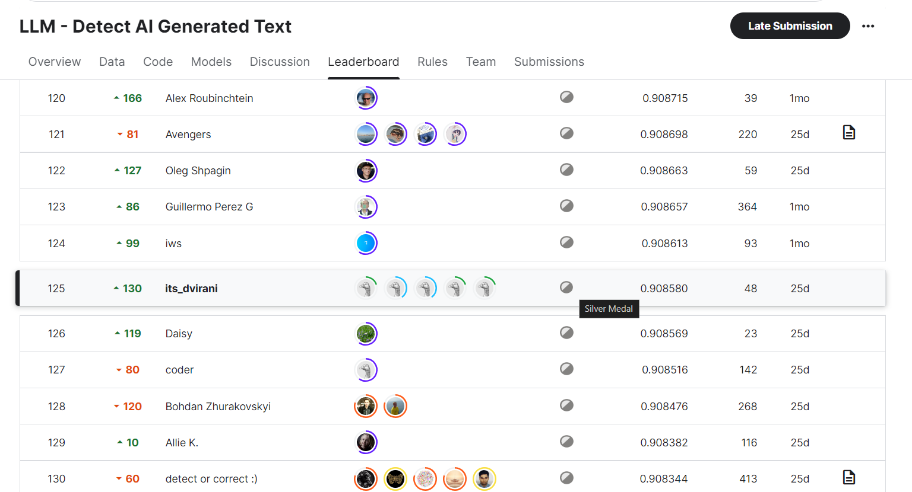
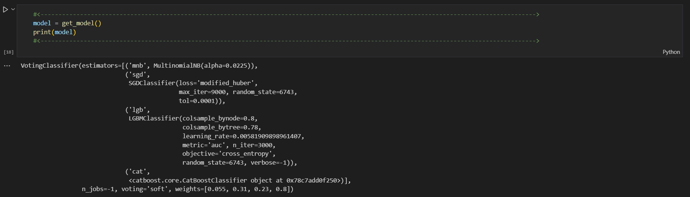

# LLM-AI-Generated-Text-Detection
- [About](#about)
- [DataSet Details](#dataset-details)
- [Accuracy](#accuracy)
- [Leaderboard Details](#leaderboard-details)
- [Data Reading](#data-reading)
- [Byte Pair Encoding](#byte-pair-encoding)
- [TF-IDF](#tf-idf)
- [Ensemble Model](#ensemble-model)
- [Dependencies](#dependencies)
- [Usage](#usage)

# About
This is a **Kaggle competition** hosted by Vanderbilt University and The Learning Agency Lab (October 31,2023 to January 23,2024). Developed a machine learning model to accurately **differentiate essays written by students from those generated by large language models**, addressing concerns about plagiarism and the impact of LLMs on education.

# DataSet Details
The competition dataset comprises about **10,000 essays**, some written by students and some generated by a variety of large language models (LLMs). The goal of the competition is to determine whether or not essay was generated by an LLM.

- All of the essays were written in response to one of **seven essay prompts**.
  
-  **Training Data:** Essays from **two of the prompts** compose the training set; the remaining essays compose the hidden test set. Nearly all of the training set essays   
  were written by students, with only a few generated essays given as examples. You may wish to generate more essays to use as training data.

-  **Testing Data:** The data in test_essays.csv is only dummy data.There are about **9,000 essays** in the test set, both student written and LLM generated.

# Accuracy
- **Public Score:** 0.963797 (Calculated on 46% of test data)
- **Private Score:** 0.908580 (Calculated on 54% of test data)

# Leaderboard Details
We secured **Silver medal** in this competition **ranking 125 out of 4359** participants **globally**, representing the **Top 3%** of the teams

# Data Reading
- Data Loading and Preprocessing for Text Classification
1. **Data Loading**: We load the data from the following CSV files:
    - `train_v2_drcat_02.csv` for Training data
    - `test_essays.csv` for Testing data
    - `sample_submission.csv` for sample submission format
2. **Data Cleaning**: 
    - Duplicate rows in the training data are removed based on the 'text' column
   
      `train = train.drop_duplicates(subset=['text'])`
    - Additionally, certain prompts are excluded from the training set.
      
      `excluded_prompt_name_list = ['Distance learning','Grades for extracurricular activities','Summer projects']`
3. **Preprocessing**: Preprocessing steps such as setting lowercase conversion and defining the vocabulary size are applied.

# Byte Pair Encoding
- Creating Byte-Pair Encoding Tokenizer with Hugging Face
1. Initialization of the raw tokenizer with BPE model and special tokens.
2. Addition of normalization and pre-tokenization processes, such as NFC normalization and byte-level pre-tokenization.
3. Training of the tokenizer using a trainer instance and a provided dataset.
4. Creation of a Hugging Face dataset object from a pandas DataFrame.
5. Iterative training of the tokenizer from the dataset using a custom corpus iterator.
6. Initialization of a PreTrainedTokenizerFast object using the trained raw tokenizer.
7. Tokenization of test and train text data using the tokenizer.

# TF-IDF
- TF-IDF Vectorization with Custom Vocabulary
1. **Function Definition**: A dummy function `dummy` is defined, which simply returns the input text.
2. **Vectorizer Initialization**: The `TfidfVectorizer` is initialized with specific parameters such as ngram_range, lowercase, sublinear_tf, and the use of the dummy function for tokenization and preprocessing.
3. **Fitting and Vocabulary Extraction**: The vectorizer is fitted on tokenized texts from the test dataset, and the resulting vocabulary is extracted.
4. **Vectorization with Custom Vocabulary**: Another `TfidfVectorizer` is initialized with the vocabulary extracted in the previous step, ensuring that the same vocabulary is used for both training and test data vectorization.
5. **Vectorization of Texts**: The training and test datasets are transformed into TF-IDF representations using the vectorizer.
6. **Memory Management**: The vectorizer object is deleted, and garbage collection is triggered to manage memory usage.

# Ensemble Model
1. **Model Definition**: The `get_model()` function defines an ensemble of classifiers:
    - Multinomial Naive Bayes
    - Stochastic Gradient Descent
    - LightGBM
    - CatBoost.
2. **Initialization**: The ensemble model is initialized with specific parameters and weights assigned to each base classifier.
3. **Model Training**: If the number of texts in the test dataset is more than 5, the ensemble model is trained on the TF-IDF transformed training data (`tf_train`) along with labels (`y_train`).
4. **Prediction**: The trained model is used to predict probabilities for the test dataset (`tf_test`), and the predictions are stored in the 'generated' column of the submission dataframe (`sub`).
5. **Saving Predictions**: The submission dataframe with predictions is saved to a CSV file named 'submission.csv'.

# Dependencies
- pandas
- scikit-learn
- numpy
- lightgbm
- tokenizers
- transformers
- tqdm
- catboost

# Usage
1. Clone the repository.
2. Install the required dependencies.
3. Download the dataset from Kaggle(We have provided the dataset in our repo also).
4. Run the provided scripts for data loading, preprocessing, model training, and prediction.
5. Use the trained model to predict whether essays are written by students or generated by LLMs.
6. Submit the predictions on the test set to evaluate the model's performance.

Competition Link: https://www.kaggle.com/competitions/llm-detect-ai-generated-text

